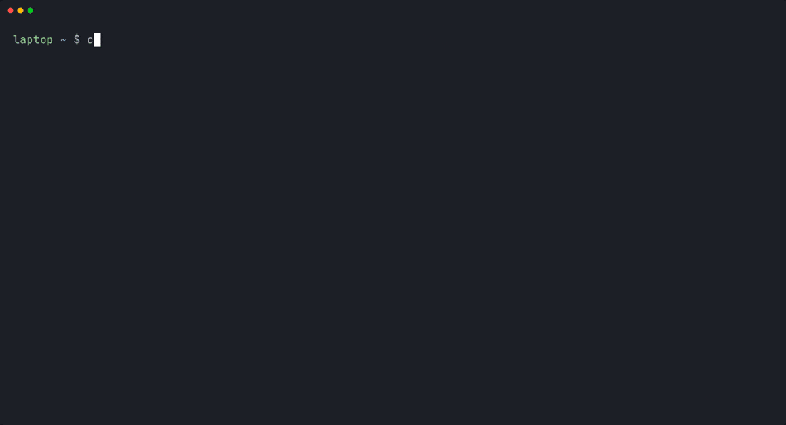
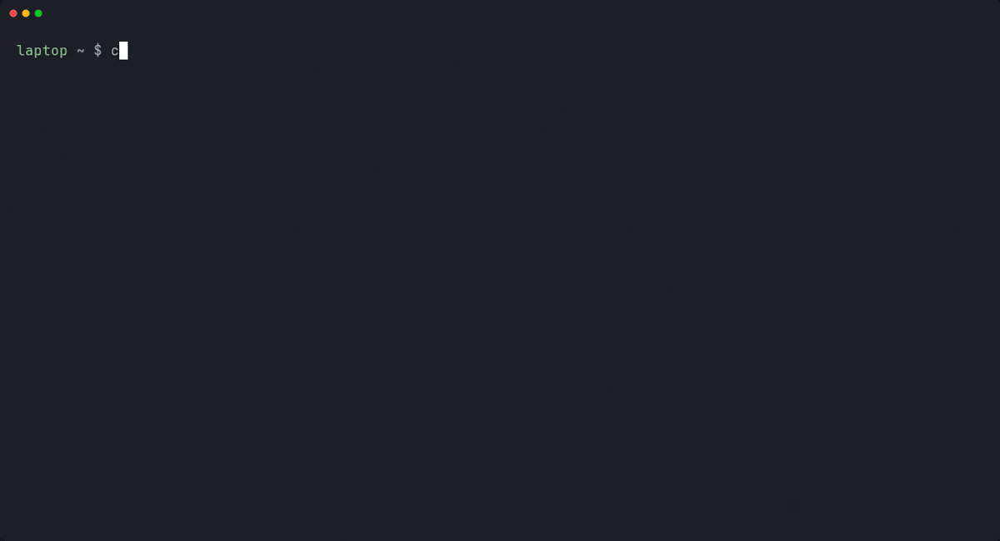

# cx

**Run Claude Code on your servers. Manage it from your laptop.**

Claude Code often has to run somewhere other than your laptop — the
credentials live on a server, the code lives on a server, or the work is
long-running and shouldn't die with your SSH session. Once that's true for
more than one machine, you're retyping `ssh` commands and keeping track of
which box has which project in your head. `cx` makes a fleet of servers feel
like one workspace.



**The client holds no credentials and never runs Claude Code locally.** Claude
runs on your servers, signed in there once, interactively. `cx` only reaches
servers over SSH and asks them questions, so nothing about your Claude sign-in
ever passes through the machine you're typing on. That is the constraint the
whole design serves, not a limitation to work around.

```
CLIENT (no Claude, no credentials)          SERVER (Claude runs here)
┌───────────────────────────────┐          ┌──────────────────────────────┐
│ cx                            │──ssh────▶│ cx-agent                     │
│   reads your ~/.ssh/config    │          │   owns the project registry  │
│   fans out, merges, caches    │◀──JSON───│   drives tmux + Claude Code  │
└───────────────────────────────┘          │ ~/.claude/  ← credentials    │
                                           └──────────────────────────────┘
```

Sessions live in tmux on the server, so closing your laptop mid-task doesn't
stop Claude. Run `cx open web1:api` again from anywhere and you're back in the
same conversation.

---

## Install

```sh
git clone https://github.com/farajzadeh/cx.git
cd cx
./install.sh
```

Or, if you're comfortable piping curl into a shell:

```sh
curl -fsSL https://raw.githubusercontent.com/farajzadeh/cx/main/install.sh | bash
```

`./install.sh --check` shows what it needs and what it would change, without
touching anything.

**Requirements.** Client: bash 3.2+ (macOS's default works), `ssh` 7.3+,
`jq`, `git`; `fzf` is optional. Servers: any Linux with a package manager `cx`
recognises — it installs `tmux`, `git`, `jq`, `curl` and Claude Code itself.

### Shell completion

`install.sh` sets it up where it can; otherwise:

| Shell | |
|---|---|
| **bash** | Linked into `~/.local/share/bash-completion/completions/cx`, which the bash-completion package loads by itself. Without that package, add `eval "$(cx completion bash)"` to `~/.bashrc` (`--shell-setup` writes an equivalent line). |
| **zsh** | `source <(cx completion zsh)` in `~/.zshrc`, after `compinit` — or as a file on `$fpath`: `cx completion zsh > ~/.zfunc/_cx` with `fpath=(~/.zfunc $fpath)` before `compinit`. |
| **oh-my-zsh** | `install.sh` links the plugin into `$ZSH_CUSTOM/plugins/cx`; add `cx` to `plugins=(...)` in `~/.zshrc` and open a new shell. By hand: `ln -s ~/.local/share/cx/completions/omz/cx "${ZSH_CUSTOM:-$HOME/.oh-my-zsh/custom}/plugins/cx"`. The plugin also defines `cxl`, `cxo`, `cxp` and `cxs` (`cx ls`, `open`, `peek`, `status`); `zstyle ':omz:plugins:cx' aliases no` turns them off. |
| **fish** | `cx completion fish > ~/.config/fish/completions/cx.fish` |

---

## Quick start

```sh
cx host add                  # a few questions; offers to set the server up
cx provision web1            # install the agent (host add can do this for you)
cx login web1                # one-time Claude Code sign-in, on the server
cx new web1:api --repo https://github.com/acme/api.git
cx open web1:api             # a persistent Claude session; Ctrl-b d detaches
cx ls                        # everything, on every server
```

---

## Tour

### Pick instead of typing


At a terminal, leave the target out and cx offers a menu of what fits: live
sessions for `stop` and `nudge`, projects for `rm`, and for `open` everything
plus a "+ new session" entry. It is fzf when installed, with a preview read
from the cache, and a numbered menu with a text filter when not. Scripts,
pipes, `--json` and `-y` never see a menu — a missing target is still exit 3.

```sh
cx open                      # choose any project, worktree or session
cx stop                      # choose among the live ones
CX_PICKER=builtin cx open    # skip fzf; CX_PICKER=none turns menus off
```

### Find anything


`cx find` lists every project, worktree and live session, then asks what to do
with the one you chose — open, shell, code, peek, nudge, stop, a new
`@session`, or print. Each runs the ordinary cx command. `--print` writes just
the target, so it composes:

```sh
cx find api                  # start with "api" typed into the filter
cx ask "$(cx find --print api)" "what changed today?"
```

### Create and open in one step


`cx new` and `cx wt add` can open a session in what they just made. With no
target at a terminal, `cx new` asks for the server, the name and a repository.

```sh
cx new web1:blog --open                  # git init, then attach
cx new web2:docs --repo <url> -d         # clone, start a session detached
cx wt add web1:api/ratelimit --open      # a worktree, and a session in it
cx new                                   # asks for each part
```

Without `--open` or `--no-open`, `CX_OPEN_AFTER_CREATE` decides (by default,
ask at a terminal).

### Parallel work: `@label` and `/worktree`


Two orthogonal axes, and picking the right one matters:

- **`@label` — another conversation on the same files.** Same directory, same
  branch, its own Claude session and history. Good for a review thread running
  alongside the work.
- **`/worktree` — another branch and directory.** A `git worktree` is a second
  checkout on its own branch. Two sessions in two worktrees cannot overwrite
  each other's work, which two sessions in one directory absolutely can.

```sh
cx open web1:api@review              # a second conversation, same files
cx wt add web1:api/authfix           # new branch 'authfix', new directory
cx open web1:api/authfix@tests       # they nest: a conversation in a worktree
cx wt rm web1:api --merged           # clear out the finished ones; branches stay
```

Each session is pinned to its own Claude conversation, so they never collide
however many you run. cx records nothing about worktrees — `git worktree list`
is the source of truth, so one you make by hand over SSH shows up in `cx ls`.
A worktree branches from a commit, so an empty project needs one first.

### Search, filter, group



The filters compose, and `--json` honours all of them in its usual shape.
A project that matches keeps its worktrees; one that matches only through a
worktree is shown with just that worktree.

```sh
cx ls auth                   # project, worktree, branch or repo containing "auth"
cx ls --live --host web1     # running now, on web1 only (web2 is not contacted)
cx ls --idle 30d             # not touched in a month
cx ls --group host --sort active
```

### Tab completion


Tab completes commands, flags, servers and whole targets —
`web1:` → `web1:api` → `web1:api/authfix` → `web1:api@review` — with sessions
described by what they are doing where the shell can show it. It never touches
the network: it reads what cx last saw, so run `cx ls` once for projects and
`cx peek` for sessions.

### Watching and steering sessions


With several sessions going, the question becomes which one needs you.
`cx peek` reads each session's own conversation and reports `idle` (waiting
for you), `working`, `blocked` (usually a permission prompt), `dead`, `fresh`
or `starting`. `cx nudge` types the next instruction into one that is ready,
without attaching, and declines rather than making a mess when it is mid-turn,
blocked or open in front of you.

```sh
cx open -d web1:api/authfix@tests    # start one without attaching
cx peek                              # what each session is doing
cx nudge web1:api/authfix@tests "the retry test still fails, fix it"
```

The rest — a tmux status bar and a tab per session, notifications, goals with
a definition of done, and the driver subagent that pushes sessions towards
them — is in [Driving Sessions](https://github.com/farajzadeh/cx/wiki/Driving-Sessions)
and [Status Bar and Tabs](https://github.com/farajzadeh/cx/wiki/Status-Bar-and-Tabs).

---

## Commands

`cx <command> --help` documents each one. Global flags work anywhere in the
line: `-r`/`--refresh`, `--no-cache`, `--stale`, `--json`, `-y`, `--no-color`.

| Servers | |
|---|---|
| `cx host add` / `import <alias>` | add a server, or adopt one from `~/.ssh/config` |
| `cx host ls` / `test` / `edit` / `rm` | manage servers (`ls --down`: which did not answer) |
| `cx provision <host>` / `--all` | install or update the agent (idempotent) |
| `cx login <host>` | one-time Claude Code sign-in |
| `cx doctor [host]` | check this machine and every server |

| Projects | |
|---|---|
| `cx new <host>:<name> [--repo URL] [--open \| -d]` | create or clone a project |
| `cx ls [host] [pattern] [--git]` | list projects and worktrees; filters above |
| `cx rm <target> [--purge]` | unregister (`--purge` also deletes files) |

| Parallel work | |
|---|---|
| `cx open <target>@<label>` | a second conversation on the same files |
| `cx wt add <target>/<name> [--branch B] [--open]` | a worktree: own branch, own directory |
| `cx wt ls [host[:project]] [-f PATTERN]` | list worktrees |
| `cx wt rm <target>/<name> [--force]` / `<target> --merged` | remove one, or every merged one (branches are kept) |

| Working | |
|---|---|
| `cx open <target> [-d]` | attach a Claude session, resuming its conversation |
| `cx resume` / `shell` / `code <target>` | pick an older conversation / plain shell / VS Code |
| `cx ask <target> "prompt"` | one-shot question, printed to stdout |
| `cx status` | live sessions across servers |
| `cx stop <target> [--all]` / `cx forget <target>` | end a session / drop a finished one |
| `cx find [query] [--print]` | choose any target from a menu, then act |

| Driving | |
|---|---|
| `cx peek [target] [--all \| --goal G]` | what each session is doing now |
| `cx nudge <target> "prompt"` | type into a running session |
| `cx bar` / `tabs` / `jump` | tmux status bar, a tab per session, go to the one that needs you |
| `cx goal new` / `ls` / `show` / `pause` / `done` / `on-stop` | definitions of done, and who is on them |
| `cx driver` | print the cx-driver subagent |

| Cache and shell | |
|---|---|
| `cx cache status` / `clear [host]` | inspect or drop cached data |
| `cx completion bash \| zsh \| fish` | print the completion script |

**Targets** are `host:project[/worktree][@session]` — `web1:api`,
`web1:api@review`, `web1:api/authfix`, `web1:api/authfix@tests`. A bare
`project` resolves against `CX_DEFAULT_HOST`, or across every server when the
name is unique; if it is ambiguous, cx says so rather than guessing.

**Exit codes** are stable, so scripts can branch on them:

| | |
|---|---|
| `0` | success |
| `1` | general error |
| `2` | not found |
| `3` | usage (including a missing target with no terminal to ask at) |
| `4` | conflict |
| `5` | ambiguous target |
| `78` | configuration error |
| `130` | you backed out of a menu |

---

## Learn more

The [wiki](https://github.com/farajzadeh/cx/wiki/Home) has the depth this page
leaves out:

| | |
|---|---|
| [Interactive Picking](https://github.com/farajzadeh/cx/wiki/Interactive-Picking) | menus, fzf, `cx find`, `CX_PICKER` |
| [Filtering and Search](https://github.com/farajzadeh/cx/wiki/Filtering-and-Search) | every `cx ls` filter, patterns, grouping and sorting |
| [Shell Completion](https://github.com/farajzadeh/cx/wiki/Shell-Completion) | setup per shell, and where completions come from |
| [Creating and Opening](https://github.com/farajzadeh/cx/wiki/Creating-and-Opening) | `cx new`, `cx wt add`, `CX_OPEN_AFTER_CREATE` |
| [Parallel Work](https://github.com/farajzadeh/cx/wiki/Parallel-Work) | `@label` and `/worktree` in detail |
| [Driving Sessions](https://github.com/farajzadeh/cx/wiki/Driving-Sessions) | peek, nudge, goals, the driver subagent, `goal on-stop` |
| [Status Bar and Tabs](https://github.com/farajzadeh/cx/wiki/Status-Bar-and-Tabs) | `cx bar`, `cx tabs`, `cx jump`, the server's bar, the notify hook |
| [Session States](https://github.com/farajzadeh/cx/wiki/Session-States) | what idle, working, blocked, fresh, starting and dead mean |
| [Skipping Permission Checks](https://github.com/farajzadeh/cx/wiki/Skipping-Permission-Checks) | `--dangerously-skip-permissions`, and how cx remembers it |
| [Speed and Caching](https://github.com/farajzadeh/cx/wiki/Speed-and-Caching) | why the cache is safe, and how to bypass it |
| [How Sessions Survive](https://github.com/farajzadeh/cx/wiki/How-Sessions-Survive) | tmux, reattaching, pinned conversations |
| [What It Touches](https://github.com/farajzadeh/cx/wiki/What-It-Touches) | exactly what cx changes on your machine and servers |
| [Worked Example](https://github.com/farajzadeh/cx/wiki/Worked-Example) | a project built end to end by two driven sessions |
| [Autonomous Builds](https://github.com/farajzadeh/cx/wiki/Autonomous-Builds) | setting up a goal to run unattended |
| [Pitfalls](https://github.com/farajzadeh/cx/wiki/Pitfalls) | the mistakes worth avoiding |

In the repository:

| | |
|---|---|
| [docs/SERVERS.md](docs/SERVERS.md) | adding servers, SSH keys, bastions, adopting existing configs |
| [docs/CONFIGURATION.md](docs/CONFIGURATION.md) | every setting and environment variable |
| [docs/TROUBLESHOOTING.md](docs/TROUBLESHOOTING.md) | when something doesn't work |
| [docs/ARCHITECTURE.md](docs/ARCHITECTURE.md) | how it works, and why it's built this way |
| [docs/cx-driver.agent.md](docs/cx-driver.agent.md) | the driver subagent, as `cx driver` prints it |
| [CONTRIBUTING.md](CONTRIBUTING.md) | tests, portability rules, sending a patch |
| [issues/](issues/) | known issues not yet fixed, with full context |

---

## Status

Version 0.5.0. The core loop — add a server, create projects, open persistent
Claude sessions, work in parallel, list and find everything — is stable and
covered by integration tests that run against real SSH servers in containers.
The driving side (peek, nudge, goals, the status bar) is newer, and its
interfaces may still change.

If you hit something, please open an issue with the output of `cx doctor`.

## License

MIT — see [LICENSE](LICENSE).
